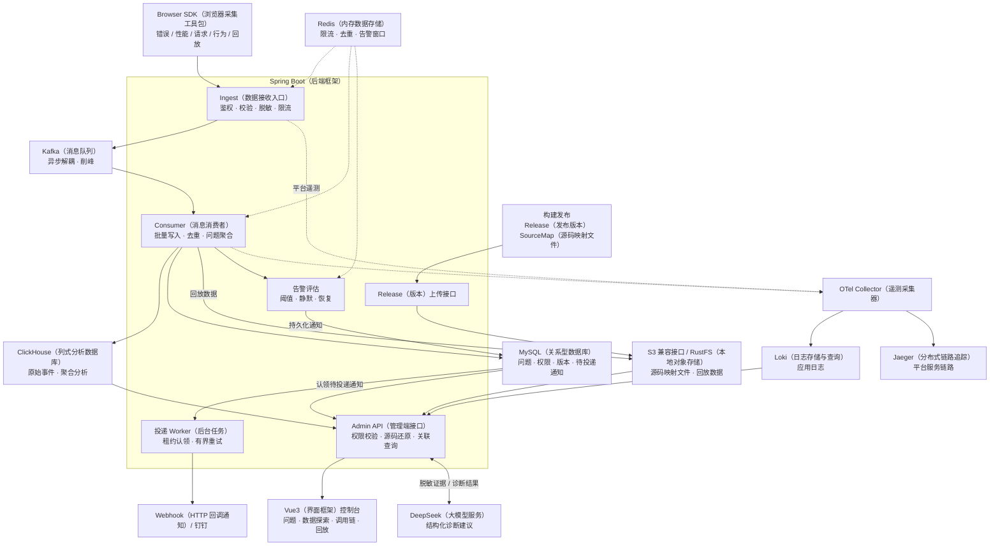

# 前端可观测平台｜面试核心提纲

## 1. 项目介绍（约 40 秒）

这是一个基于 mall-tiny（后端基础项目）/ Spring Boot（Java 应用开发框架）扩展的前端可观测平台，参考 Sentry（异常监控与可观测平台）的核心产品模型。通过浏览器 SDK（采集工具包）采集错误、性能、请求、用户行为和回放，把分散的事件聚合成 Issue（同类问题集合），再关联源码、Trace（请求调用链）、日志和 Release（发布版本），帮助定位线上问题并完成告警、处理和回归确认。

项目重点是把“采集到一个报错”做成“能还原现场、判断影响、找到源码并跟踪处理”的完整链路。

## 2. 架构与技术选型

**讲图顺序：** 先讲 SDK → Kafka → 分层存储，再讲 Issue 如何关联源码、回放和日志，最后补充告警与 AI。项目业务 Span（一次操作的耗时片段）存于 ClickHouse；Jaeger 展示平台服务自身的链路。

| 层次 | 核心技术与作用 |
|---|---|
| 采集 / 控制台 | TypeScript（带类型的 JavaScript）、Vue3（界面框架）、rrweb（网页录制与回放库）；浏览器采集、回放和分析界面 |
| 服务端 | Java 17、Spring Boot 3.5、Spring Security（安全与权限框架）/ JWT（身份认证令牌） |
| 消息 / 缓存 | Kafka 削峰与批量消费；Redis 限流、短期去重、告警窗口 |
| 存储 | ClickHouse 做事件分析；MySQL 管业务状态；本地 RustFS 提供 S3 兼容对象存储 |

## 3. 最值得讲的技术难点

### ① SDK（采集工具包）如何兼顾覆盖率和业务性能？

- 统一事件协议，新增 track/page/identify（业务事件/页面访问/用户识别）与发送前 beforeSend（过滤和改写）钩子，覆盖 JS（JavaScript）/ Promise（异步任务）/资源错误、Vue/React 框架错误、Fetch/XHR（浏览器网络请求）、Web Vitals（核心网页体验指标）和 Breadcrumb（用户操作轨迹）。
- 通过采样、批量队列、持久化队列、指数退避和网络恢复重发控制开销；页面退出时尽力发送剩余数据。
- Replay（用户会话回放）使用 rrweb，默认遮罩输入和敏感 DOM（页面元素）；错误前后上下文保留按需开启。

**追问：能保证上报不丢吗？** 不能。浏览器退出、存储限制和断网仍可能丢失，设计目标是提高送达率，并限制监控自身的资源消耗。

### ② 压缩代码的错误栈怎么还原？

逐帧提取文件、行、列，以项目、Release、环境匹配私有 SourceMap（压缩代码与源码的映射文件），解析 Source Map v3 / Base64 VLQ（行列位置的变长编码），展示原始位置和源码上下文。映射失败的帧保留原始位置。

**关键取舍：** 版本匹配优先于映射成功率，错误版本的源码会误导排查；SourceMap 不公开放在站点上。

### ③ 如何聚合 Issue（同类问题）、处理重复消费？

- 对错误类型、消息、文件和栈做归一化，移除动态 ID、资源 hash（文件内容哈希）等噪声，再生成 SHA-256（哈希算法）fingerprint（错误指纹）。
- Kafka 按至少一次消费设计；Redis 用 eventId（事件唯一标识）做短期去重，失败释放预留以允许重试；ClickHouse 使用 ReplacingMergeTree（后台合并去重的表引擎）支持事件去重。
- Issue 记录首次/最近发生、影响人数及回归状态；解决之后的新事件可触发重开，迟到旧事件不触发回归。

**追问：是不是 exactly-once（消息仅处理一次）？** 不是。Redis、Kafka、ClickHouse、MySQL 跨存储没有统一原子事务；去重窗口、进程崩溃和后台合并都需要单独考虑。

### ④ 告警如何避免刷屏和丢失？

阈值判断结合持续时间、冷却、静默和恢复状态。通知先写 MySQL 持久 outbox（待投递通知表），Redis 调度重试，多实例通过租约和 CAS（比较并交换）防止并发重复认领；HTTP（网络通信协议）请求成功还要检查渠道业务成功码，失败执行有界重试。

**追问：发送成功后、写状态前崩溃呢？** 仍可能重复发送，所以投递 ID 必须可追踪，不能宣称通知绝对只发一次。

### ⑤ 不同存储的数据如何统一分析？

业务分析按页面 ID 统计 PV、按已识别用户统计 UV，停留只累计可见区间；性能指标先按 metricId（指标标识）取最新报告，避免一次访问多次更新被重复加权。通过项目、时间、环境、Release、Trace ID（调用链标识）关联事件和日志。混合数值聚合先合并各源的总和与有效样本数，再计算平均值；唯一用户统计合并用户 ID 集合，不能直接相加。归并后再排序、截取前 100 组，避免提前截断造成错误排名。

**关键边界：** 只开放两边都能执行的筛选；缺失、非法和非有限数值不当作零。跨信号聚合前要确认指标和单位一致。

### ⑥ 企业能力与 AI（人工智能）怎么落地？

- 租户、团队、项目分层授权，服务端强制校验；SAML（企业单点登录协议）/ SCIM（用户与组同步协议）、审计、脱敏及可续跑的数据删除任务已实现。
- Webhook 防 SSRF（服务端请求伪造）：校验 DNS（域名解析）的地址、固定已验证 IP（网络地址）连接、拒绝内网目标和重定向。
- AI 汇总还原后的源码、关联事件、Span、日志及 Replay 摘要；发送前和返回后脱敏，并严格校验结构化结果。AI 提供排查建议，业务证据仍是判断依据。

## 4. 一次问题排查怎么讲？

**告警 → Issue 影响范围 → Release/环境 → SourceMap 原始栈 → Breadcrumb/Replay 还原操作 → Trace/Logs（调用链/日志）定位关联请求 → 修复发布 → 观察是否回归。**

## 5. 可用证据与交付边界

- 已有真实浏览器“Vue 错误 → Issue → SourceMap → Breadcrumb → Replay”本地验收，以及 Trace 和告警恢复验证。
- 本地 Ingest 压测：**80 req/s（每秒请求数）× 1 分钟，4,800 次成功，P95 3.64 ms（95% 的请求耗时不超过 3.64 毫秒）**。这是本机接收接口结果，不能当作生产容量或端到端处理耗时。
- 核心能力已实现；生产发布、真实 IdP（企业身份提供方）、云端容量和最新完整 E2E（端到端测试）尚未完成。DeepSeek 合成上下文调用已通过，真实业务 Issue 分析与真实钉钉 outbox 交付仍待验收。
- 面试中按实际参与模块说明个人职责；不把产品目标、未验收能力或整个平台成果全部当成个人已交付成果。

> 依据：README、ROADMAP 与 SDK、Consumer、Fingerprint、SourceMap、告警及查询服务源码。历史验收和具体限制以 ROADMAP 为准。
