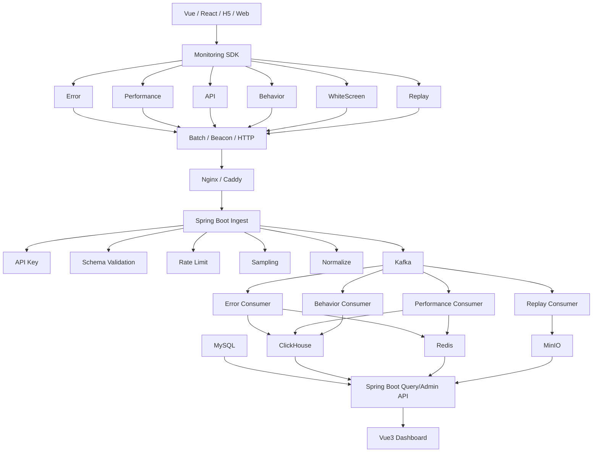

# 企业级前端可观测与异常监控平台：Spring Boot 全栈项目实施总纲

> 版本：V1.0  
> 用途：后续项目开发、架构设计、任务拆分、技术学习、面试准备统一依据  
> 核心决策：**mall-tiny 3.x 作为 Spring Boot 基础骨架，RuoYi-Vue-Plus / Apache HertzBeat / Sentry / web-see / fee 等作为架构与领域能力参考，监控核心能力自研。**

---

## 0. 最终决策

本项目不采用“完全从 0 到 1 重写所有企业基础能力”，也不直接对一个大型监控平台做全量魔改。

最终方案：

```text
mall-tiny 3.x
    │
    │ 复用 Spring Boot 企业基础能力
    │
    ├── Spring Security / JWT
    ├── RBAC
    ├── MyBatis-Plus
    ├── Redis 基础能力
    ├── Validation
    ├── 全局异常处理
    ├── SpringDoc
    └── Docker 基础
    │
    ▼
自研 Monitoring Domain
    │
    ├── TypeScript Monitoring SDK
    ├── Spring Boot Ingest
    ├── Kafka 数据管道
    ├── ClickHouse 监控数据仓库
    ├── Error Fingerprint / Issue 聚合
    ├── SourceMap 定位
    ├── Breadcrumb 用户行为轨迹
    ├── Session Replay
    ├── Release / Git Commit 关联
    ├── Alert Engine
    └── Vue3 Dashboard
```

项目定位：

> **企业级前端可观测与异常监控平台**

重点不是 CRUD，而是：

> **高吞吐监控数据采集 + 异步数据处理 + OLAP 分析 + 故障现场还原 + 告警闭环。**

---

# 1. 项目目标

平台解决 Web / H5 / Vue / React 项目线上运行过程中以下问题：

1. 前端发生 JavaScript 异常后，研发无法及时发现。
2. 即使知道错误，也很难快速还原到源码位置。
3. 缺少用户出错前的点击、路由、接口请求上下文。
4. 缺少真实用户环境下的 Web Vitals 性能数据。
5. 错误数据量大，同类错误不能自动聚合。
6. 新版本发布后，不容易快速判断异常是否由 Release 引入。
7. 错误量、白屏率、接口失败率、LCP 等达到阈值后缺少实时告警。
8. 海量监控事件直接写 MySQL 不适合高吞吐写入和多维分析。
9. 监控基础设施部署复杂，希望通过 Docker Compose 一键拉起。
10. 传统第三方监控 SaaS 在私有化、成本和业务定制方面存在约束。

最终形成：

```text
采集
  ↓
上报
  ↓
接入
  ↓
消息队列
  ↓
消费 / 清洗 / 聚合
  ↓
存储
  ↓
分析
  ↓
错误定位
  ↓
告警
  ↓
可视化
  ↓
问题处理闭环
```

---

# 2. 原始资料方案与本项目改造关系

上传资料中的原始链路为：

```text
指标分析
  ↓
SDK 封装
  ↓
SDK DSN 服务
  ↓
数据统计
  ↓
数据监控 / 可视化平台
```

原资料主要采用：

```text
TypeScript SDK
+
NestJS DSN
+
Kafka
+
ClickHouse
+
React Monitor
+
NestJS Monitor API
+
PostgreSQL
+
Redis
+
Docker Compose
+
Caddy
```

本项目保留其监控领域核心思想，但进行以下调整：

| 原方案 | 本项目 |
|---|---|
| NestJS DSN | **Spring Boot Ingest** |
| NestJS Monitor API | **Spring Boot Query / Admin API** |
| PostgreSQL | **MySQL** |
| React Monitor | **Vue3 管理平台**（也可保留 React） |
| Kafka | 保留 |
| ClickHouse | 保留 |
| Redis | 保留 |
| Docker Compose | 保留并增强 |
| Caddy | Caddy / Nginx 二选一 |
| SDK Core + Adapter | 保留并增强 |
| 性能 / 异常采集 | 保留并增强 |
| 物化视图 | 保留 |
| CI/CD | 保留并增加 Release / SourceMap 上传 |

---

# 3. 开源参考项目与职责边界

## 3.1 mall-tiny 3.x

仓库：

```text
https://github.com/macrozheng/mall-tiny
```

使用：

> **Spring Boot 项目基础骨架。**

建议使用 `3.x` 分支：

```text
Java 17
Spring Boot 3.5.x
Spring Security
MyBatis-Plus
Redis
SpringDoc
Validation
Docker
```

主要复用：

```text
Spring Boot 基础工程
Spring Security
JWT / 登录认证
RBAC
统一响应
全局异常
Bean Validation
MyBatis-Plus
Redis 基础配置
SpringDoc
基础 Docker 配置
```

不把 mall-tiny 自带代码包装成自己的核心创新。

### 自己重点理解

必须真正吃透：

```text
SecurityFilterChain
JWT
Authentication
SecurityContext
RBAC
Controller / Service / Mapper
MyBatis-Plus
事务
Redis
Validation
Global Exception Handler
```

---

## 3.2 RuoYi-Vue-Plus

仓库：

```text
https://github.com/dromara/RuoYi-Vue-Plus
```

定位：

> **企业工程化设计参考，不直接作为本项目主底座。**

重点参考：

```text
模块拆分
权限模型
企业级工程结构
操作日志
任务调度
文件 / OSS
Redis / Redisson
SSE / WebSocket
统一异常
统一返回
配置管理
部署结构
```

原则：

> 只参考设计和成熟实践，不把大量 RuoYi 内置功能直接搬入项目，避免项目核心能力变成“框架自带”。

---

## 3.3 Apache HertzBeat

仓库：

```text
https://github.com/apache/hertzbeat
```

定位：

> **监控对象、指标模型和告警架构参考。**

重点学习：

```text
Monitor
Metric
Collector
Alert
Threshold
Notification
监控任务
监控对象抽象
指标定义
告警规则
通知通道
```

本项目不直接二开 HertzBeat。

原因：

```text
项目规模大
学习成本高
领域偏基础设施监控
容易把精力耗在理解 HertzBeat 本身
```

本项目只吸收：

> **监控模型 + 告警模型 + 可扩展采集思想。**

---

## 3.4 Sentry

仓库：

```text
https://github.com/getsentry/sentry
```

定位：

> **异常诊断模型和故障定位闭环的核心参考。**

重点参考思想：

```text
Event
  ↓
Fingerprint
  ↓
Issue
  ↓
Stack Trace
  ↓
SourceMap
  ↓
Breadcrumb
  ↓
Session Replay
  ↓
Release
```

本项目重点学习：

```text
异常分组
Issue 模型
错误上下文
源码定位
Release 关联
Breadcrumb
Replay
错误趋势
影响用户
First Seen / Last Seen
```

### 重要

Sentry 当前仓库使用的不是简单 MIT/Apache 许可证，而是带使用限制的 Functional Source License。

因此：

> **本项目只参考产品和架构设计思想，不复制 Sentry 源代码实现。**

---

## 3.5 web-see

仓库：

```text
https://github.com/xy-sea/web-see
```

定位：

> **浏览器监控 SDK 功能和实现思路参考。**

可参考：

```text
JavaScript Error
Resource Error
XHR / Fetch Error
FP / FCP / LCP / CLS / TTFB
Long Task
Memory
White Screen
Breadcrumb
Session Replay
错误去重
sendBeacon / 图片打点 / HTTP
Vue2 / Vue3 / React
```

其中非常值得学习：

```text
插件化 SDK
错误 Hash
白屏检测
录屏
行为轨迹
多种上报方式
```

注意：

> 当前仓库未发现常见 LICENSE 文件时，不默认拥有公开复制和再分发代码的授权。公开项目中以“学习设计思路 + 自己重写”为原则。

---

## 3.6 web-see-demo

仓库：

```text
https://github.com/xy-sea/web-see-demo
```

重点参考：

```text
SourceMap
错误列表
错误还原
录屏
行为轨迹
测试异常页面
```

尤其参考：

```text
线上压缩代码位置
        ↓
SourceMap
        ↓
原始源码位置
```

同样建议：

> 参考思路，核心逻辑自己实现。

---

## 3.7 LianjiaTech / fee

仓库：

```text
https://github.com/LianjiaTech/fee
```

定位：

> **完整前端监控平台和早期数据管道架构参考。**

可参考：

```text
用户行为
性能监控
错误看板
告警配置
告警日志
Redis
MySQL
Kafka 数据链路
Nginx 打点
监控后台
```

Fee 中的 Kafka Demo 体现了：

```text
SDK 打点
  ↓
Nginx
  ↓
Access Log
  ↓
rsyslog
  ↓
Kafka
  ↓
Consumer
```

本项目不照搬该链路，而简化成：

```text
SDK
 ↓
Spring Boot Ingest
 ↓
Kafka
 ↓
Spring Boot Consumer
```

---

## 3.8 Fee-dev-docker

仓库：

```text
https://github.com/alphawq/Fee-dev-docker
```

定位：

> **Docker 一键开发环境思想参考。**

原项目包含：

```text
Redis
Memcached
MongoDB
MySQL
Elasticsearch
Kibana
Adminer
```

本项目不全部保留。

最终改造成：

```text
MySQL
Redis
Kafka
ClickHouse
MinIO
Kafka UI（可选）
Spring Boot
Vue3
Caddy / Nginx
```

---

## 3.9 上传课程资料

上传资料提供了以下重要思路：

```text
指标体系
SDK Core / Adapter
Monorepo
弱网上报队列
DSN
Kafka
ClickHouse
物化视图
React SaaS
Redis
PostgreSQL
Docker Compose
Caddy
CI/CD
```

其中源码注释明确出现：

> 可用于学习 / 练习，但不可直接公开课程源码。

因此：

> **课程代码只作为学习和设计参考，不复制受限源码到公开 GitHub 仓库。**

---

# 4. 参考边界总结

最终边界：

```text
基础框架：
mall-tiny 3.x

企业工程参考：
RuoYi-Vue-Plus

监控 / 告警参考：
Apache HertzBeat

异常诊断参考：
Sentry

前端 SDK 参考：
web-see
web-see-demo

监控平台数据链路参考：
LianjiaTech/fee

Docker 环境参考：
Fee-dev-docker

学习资料：
上传的企业级监控平台课程材料

--------------------------------

核心自研：

Spring Boot Ingest
Kafka Producer / Consumer
ClickHouse 数据模型
Error Fingerprint
Issue 聚合
SourceMap Resolver
Breadcrumb
Session Replay 接入
Release
Alert Engine
Vue3 Dashboard
```

---

# 5. 技术栈

## 5.1 前端 SDK

```text
TypeScript
pnpm workspace
Monorepo
PerformanceObserver
Web Vitals
MutationObserver（可扩展）
rrweb
sendBeacon
fetch keepalive
SourceMap
```

---

## 5.2 管理端

```text
Vue3
TypeScript
Vite
Pinia
Vue Router
ECharts
Element Plus
TanStack Query（可选）
```

如果后面为了体现 React：

```text
React + TanStack Query
```

也可以，但不作为第一阶段必要条件。

---

## 5.3 服务端

```text
Java 17
Spring Boot 3.5.x
Spring Security
Spring Kafka
MyBatis-Plus
MySQL
Redis
ClickHouse
MinIO
Bean Validation
SpringDoc
```

可选：

```text
Redisson
XXL-JOB
WebSocket
SSE
Micrometer
Prometheus
```

---

## 5.4 基础设施

```text
Kafka
ClickHouse
MySQL
Redis
MinIO
Docker
Docker Compose
Caddy / Nginx
Jenkins / Drone / GitHub Actions
```

---

# 6. 系统总体架构



---

# 7. 核心数据流

## 7.1 正常监控事件

```text
Browser
  ↓
SDK Capture
  ↓
Event Protocol
  ↓
Batch Queue
  ↓
sendBeacon / fetch
  ↓
Spring Boot Ingest
  ↓
Kafka Producer
  ↓
Kafka Topic
  ↓
Spring Kafka Consumer
  ↓
Normalize / Aggregate
  ↓
ClickHouse
  ↓
Spring Boot Query API
  ↓
Vue3 Dashboard
```

---

## 7.2 异常诊断链路

```text
JavaScript Error
      ↓
Error Event
      ↓
Fingerprint
      ↓
Issue
      ↓
Release
      ↓
SourceMap
      ↓
Original Source
      ↓
Breadcrumb
      ↓
API Context
      ↓
Session Replay
      ↓
完整故障现场
```

---

# 8. 项目目录设计

建议主仓库：

```text
observability-platform/

├── server/
│   ├── src/main/java/
│   │   └── com.xxx.monitor/
│   │       ├── common/
│   │       ├── security/
│   │       ├── infrastructure/
│   │       │   ├── mysql/
│   │       │   ├── redis/
│   │       │   ├── kafka/
│   │       │   ├── clickhouse/
│   │       │   └── minio/
│   │       └── modules/
│   │           ├── system/
│   │           ├── project/
│   │           ├── release/
│   │           ├── ingest/
│   │           ├── issue/
│   │           ├── performance/
│   │           ├── replay/
│   │           ├── sourcemap/
│   │           ├── alert/
│   │           └── dashboard/
│   └── src/main/resources/
│
├── sdk/
│   ├── packages/
│   │   ├── core/
│   │   ├── browser/
│   │   ├── browser-utils/
│   │   ├── vue/
│   │   ├── react/
│   │   ├── performance/
│   │   └── replay/
│   ├── demos/
│   └── pnpm-workspace.yaml
│
├── web/
│   └── Vue3 Monitor Dashboard
│
├── infra/
│   ├── docker-compose.yml
│   ├── docker-compose.deploy.yml
│   ├── mysql/
│   ├── redis/
│   ├── kafka/
│   ├── clickhouse/
│   ├── minio/
│   └── caddy/
│
├── scripts/
│   ├── upload-sourcemap/
│   └── release/
│
└── docs/
```

---

# 9. 为什么第一版不做微服务

第一版采用：

> **模块化单体。**

理由：

```text
先把业务和数据链路做透
>
先掌握 Spring Boot
>
先验证真实瓶颈
>
最后根据读写特点拆服务
```

不为了简历强行：

```text
Spring Cloud
Nacos
Gateway
Sentinel
几十个服务
```

当系统稳定后，可按实际访问特征拆：

```text
monitor-ingest   写密集型
monitor-worker   消费 / 计算密集型
monitor-api      读密集型
```

拆分理由真实：

```text
Ingest 承担高频写
Worker 独立水平扩容
Query API 不受写流量影响
```

---

# 10. SDK 架构设计

## 10.1 插件化思想

采用：

```text
Core
  ↓
Integration
  ↓
Transport
  ↓
Framework Adapter
```

核心抽象：

```text
Monitoring
Integration
Transport
Event
Scope
Context
```

### 包职责

```text
monitor-core
    │
    ├── Event Protocol
    ├── Client
    ├── Integration
    ├── Transport
    └── Queue

monitor-browser
    │
    ├── Error
    ├── XHR / Fetch
    ├── Route
    ├── Breadcrumb
    └── Browser Transport

monitor-performance
    │
    └── Web Vitals

monitor-vue
    │
    └── Vue errorHandler

monitor-react
    │
    └── ErrorBoundary

monitor-replay
    │
    └── rrweb
```

---

# 11. SDK 指标体系

## 11.1 Performance

采集：

```text
FP
FCP
LCP
CLS
TTFB
INP
Long Task
Resource Timing
Navigation Timing
```

说明：

- FID 已逐步由 INP 取代，项目以 INP 为主要交互指标。
- 使用 `PerformanceObserver` 和 Web Vitals API。
- 数据必须带 page、release、session、device 等维度。

---

## 11.2 Error

采集：

```text
window.onerror
unhandledrejection
Resource Error
Vue errorHandler
React ErrorBoundary
手动 captureException
```

事件信息：

```text
message
name
stack
file
line
column
page
release
environment
userId
sessionId
breadcrumbs
```

---

## 11.3 API

通过代理：

```text
XMLHttpRequest
fetch
```

采集：

```text
url
method
status
duration
request size
response size
traceId
timestamp
```

敏感信息必须脱敏：

```text
Authorization
Cookie
Password
Token
身份证 / 手机等业务敏感字段
```

---

## 11.4 Behavior / Breadcrumb

采集：

```text
Click
Route Change
XHR
Fetch
Console
Custom Event
```

采用环形缓冲：

```text
maxBreadcrumbs = 20 / 50 / 可配置
```

旧数据自动淘汰。

---

## 11.5 White Screen

参考：

```text
关键点采样
DOM 判断
骨架屏兼容
页面容器检查
```

白屏事件需要：

```text
page
timestamp
release
device
DOM snapshot summary
```

---

## 11.6 Session Replay

推荐：

```text
rrweb
```

策略：

```text
不是所有会话全部永久录屏
```

建议：

```text
正常用户：采样
发生 Error：保留错误前后窗口
高风险页面：提高采样率
```

Replay 数据压缩后放：

```text
MinIO
```

ClickHouse 只保存：

```text
replayId
sessionId
objectKey
timestamp
```

---

# 12. 统一 Event Protocol

建议所有事件统一 Envelope。

示例：

```json
{
  "eventId": "uuid",
  "projectId": "dcrm-web",
  "eventType": "error",
  "timestamp": 1760000000000,

  "sessionId": "session-id",
  "userId": "10086",

  "release": "v2.3.1",
  "environment": "production",

  "pageUrl": "/order/detail",
  "sdkVersion": "1.0.0",

  "traceId": "trace-id",

  "device": {
    "browser": "Chrome",
    "os": "macOS"
  },

  "data": {}
}
```

核心公共字段：

```text
eventId
projectId
eventType
timestamp
sessionId
userId
release
environment
pageUrl
sdkVersion
traceId
device
data
```

---

# 13. SDK 数据上报队列

不要每采集一次就请求一次后端。

设计：

```text
Capture Event
    ↓
Memory Queue
    ↓
Batch
    ↓
sendBeacon
    ↓
fetch keepalive fallback
```

失败：

```text
Network Error
    ↓
Retry Queue
    ↓
Backoff
    ↓
Network Recover
    ↓
Retry
```

需要考虑：

```text
batchSize
flushInterval
maxQueueSize
retryCount
backoff
pagehide
visibilitychange
beforeunload
```

---

# 14. SDK 自身性能要求

监控 SDK 不能显著影响被监控项目。

必须控制：

```text
包体积
主线程耗时
事件监听数量
MutationObserver 范围
录屏开销
网络请求数量
内存占用
```

策略：

```text
插件按需加载
采样
批量上报
节流
异步处理
Replay 单独包
```

---

# 15. Spring Boot Ingest Service

核心接口：

```text
POST /api/v1/envelope
```

职责必须保持轻量：

```text
API Key 校验
Project 校验
Request Size 限制
Schema Validation
Rate Limit
Sampling
数据基础清洗
补充服务端时间
Kafka Produce
快速响应
```

原则：

> **Ingest 不做耗时分析，不直接同步执行复杂聚合。**

---

# 16. 为什么不能直接写 MySQL

错误爆发存在突刺：

```text
正常：
100 event / s

新版本出现严重 Bug：
10,000 event / s
```

如果：

```text
SDK
 ↓
Spring Boot
 ↓
MySQL INSERT
```

容易造成：

```text
应用线程阻塞
连接池耗尽
数据库写压力
接口超时
监控服务本身雪崩
```

因此使用：

```text
Spring Boot
 ↓
Kafka
 ↓
Consumer
 ↓
Batch Insert
 ↓
ClickHouse
```

Kafka 作用：

```text
削峰
缓冲
解耦
异步
可重放
水平扩展
```

---

# 17. Kafka Topic 设计

第一版不用几十个 Topic。

建议：

```text
monitor-error-v1
monitor-performance-v1
monitor-behavior-v1
monitor-replay-v1
```

后期根据流量再拆：

```text
monitor-api-v1
monitor-white-screen-v1
```

---

# 18. Kafka Partition Key

建议：

```text
projectId
```

或：

```text
projectId + eventType
```

目标：

```text
同一个项目保持一定局部顺序
同时支持多 Partition 并发
```

---

# 19. Spring Kafka Consumer

重点掌握：

```text
@KafkaListener
Consumer Group
Partition
Offset
Batch Consumer
Manual Ack
Retry
DLQ
Idempotency
Lag
Rebalance
```

消费：

```text
Kafka
  ↓
Consumer
  ↓
Validate
  ↓
Normalize
  ↓
Fingerprint / Aggregate
  ↓
Batch
  ↓
ClickHouse
```

---

# 20. Retry / DLQ

错误事件不能无限重试。

建议：

```text
Consumer Error
   ↓
Retry 1
   ↓
Retry 2
   ↓
Retry 3
   ↓
Dead Letter Topic
```

例如：

```text
monitor-error-v1-dlq
```

后台增加：

```text
DLQ 查看
失败原因
重新消费
```

---

# 21. 幂等

Kafka 可能产生：

```text
重复消费
```

因此 Event 必须带：

```text
eventId
```

可选策略：

```text
Redis SETNX event:{eventId}
```

或在 ClickHouse 侧通过：

```text
事件唯一 ID + 数据模型
```

控制重复影响。

不要声称 Kafka 天然 exactly-once 即可完全解决业务幂等。

---

# 22. MySQL 职责

MySQL 保存：

```text
sys_user
sys_role
sys_menu
sys_user_role

monitor_project
monitor_project_member
monitor_api_key

monitor_release
monitor_sourcemap

monitor_alert_rule
monitor_alert_record

monitor_notification_channel
```

MySQL 特性：

```text
业务事务
强一致元数据
RBAC
配置
关系数据
```

---

# 23. ClickHouse 职责

ClickHouse 保存高吞吐事件：

```text
error_event
performance_event
api_event
behavior_event
white_screen_event
```

典型维度：

```text
projectId
environment
release
page
browser
os
country
device
timestamp
```

---

# 24. ClickHouse 表设计知识点

重点学习：

```text
MergeTree
PARTITION BY
ORDER BY
TTL
Materialized View
AggregateFunction
LowCardinality
DateTime64
批量 Insert
```

设计目标：

```text
高吞吐写入
时间范围查询
多维聚合
低成本趋势统计
```

---

# 25. ClickHouse Materialized View

不要 Dashboard 每次扫描所有原始 Event。

例如：

```text
raw performance_event
      ↓
Materialized View
      ↓
performance_hourly
```

可预聚合：

```text
PV
UV
Error Count
Affected Users
LCP P75
LCP P95
API Failure Rate
API P95
```

---

# 26. Redis 职责

Redis 不只是“项目用了 Redis”。

明确：

```text
Rate Limit
Fingerprint Cache
Alert Sliding Window
Dashboard Cache
Session / Token（如需要）
Distributed Lock
```

示例：

```text
error:{projectId}:{fingerprint}:5m
```

保存：

```text
errorCount
affectedUserCount
```

TTL：

```text
5 min
```

---

# 27. MinIO 职责

MinIO 保存大对象：

```text
SourceMap
Session Replay
附件
导出文件
```

不建议：

```text
大 Replay JSON 全塞 MySQL / ClickHouse
```

---

# 28. Error Fingerprint

这是项目核心自研模块之一。

原始：

```text
TypeError
message
file
line
column
stack
```

先 Normalize：

```text
去 URL 随机参数
去 hash 文件名差异
标准化 stack
过滤无意义 frame
```

然后：

```text
fingerprint =
hash(
    errorType
  + normalizedMessage
  + normalizedStack
  + sourceLocation
)
```

可使用：

```text
SHA-256
MurmurHash
xxHash
```

---

# 29. Event 与 Issue

不能后台展示几十万条相同错误。

模型：

```text
Issue
  │
  ├── Event
  ├── Event
  ├── Event
  └── Event
```

Issue 属性：

```text
issueId
fingerprint
title
status
firstSeen
lastSeen
eventCount
affectedUsers
latestRelease
assignee
priority
```

---

# 30. Issue 聚合流程

```text
Error Event
   ↓
Normalize Stack
   ↓
Generate Fingerprint
   ↓
Redis Lookup
   ↓
Issue Exist?
   ├── Yes → Update Count / LastSeen
   └── No  → Create Issue
   ↓
Store Event
```

---

# 31. SourceMap

生产代码：

```text
app.873bd.js:1:28291
```

需要还原：

```text
src/views/order/detail.vue:186
```

链路：

```text
Error
  ↓
release
  ↓
bundle filename
  ↓
line / column
  ↓
SourceMap
  ↓
Original Position
```

---

# 32. SourceMap 上传

CI/CD：

```text
pnpm build
   ↓
dist
   ↓
*.js
*.js.map
   ↓
Create Release
   ↓
Upload SourceMap
   ↓
MinIO
   ↓
Deploy
```

SDK：

```text
release = v2.3.1
```

错误事件带：

```text
release
file
line
column
```

---

# 33. SourceMap 安全

SourceMap 不应该公开暴露在 CDN。

推荐：

```text
构建生成 .map
   ↓
上传私有 MinIO
   ↓
部署时不把 .map 上传公网
```

后台只有服务端 Resolver 可以读取。

---

# 34. Breadcrumb

错误前记录：

```text
route
click
xhr
fetch
console
custom event
```

示例：

```text
10:01:21 route /order
10:01:25 click 搜索
10:01:26 GET /order/list 200
10:01:28 click #10086
10:01:29 GET /order/10086 500
10:01:30 JS Error
```

这样错误不再是孤立 Stack Trace。

---

# 35. Session Replay

Error：

```text
Issue
  ↓
Event
  ↓
sessionId
  ↓
replayId
  ↓
MinIO
  ↓
rrweb player
```

支持：

```text
错误前 N 秒
错误后 N 秒
完整 session（可选）
```

---

# 36. 隐私与 Replay

必须支持：

```text
input mask
password ignore
敏感 DOM block
URL 参数过滤
Headers 脱敏
Response 脱敏
```

默认禁止采集：

```text
password
token
authorization
cookie
支付信息
个人敏感数据
```

---

# 37. Release 模型

Release：

```text
project
version
environment
gitCommit
branch
buildTime
deployTime
sourceMap
```

例如：

```text
v2.3.1
commit: a8cdb31
```

---

# 38. Release 与 Error

Dashboard：

```text
v2.3.0
Error Rate = 0.3%

发布 v2.3.1

Error Rate = 4.8%
```

可以快速判断：

> 新 Release 是否导致错误明显增加。

---

# 39. Git Commit 关联

高级扩展：

```text
Issue
 ↓
Release
 ↓
Git Commit
 ↓
Commit Author
```

未来可以做：

```text
Suspect Commit
```

但第一版不需要自动归因。

---

# 40. Alert Engine

告警不是：

```text
只要出现 Error 就通知
```

而是：

```text
Window
+
Metric
+
Operator
+
Threshold
+
Duration
```

---

# 41. Error 告警示例

```text
时间窗口：5 min

errorCount > 100

AND

affectedUsers > 20

AND

environment = production
```

触发：

```text
Alert Event
```

---

# 42. Performance 告警

示例：

```text
LCP P75 > 4s
持续 10 min
```

或：

```text
API Failure Rate > 5%
持续 5 min
```

---

# 43. Alert Rule 模型

```text
ruleId
projectId
metric
operator
threshold
window
duration
level
channel
enabled
```

---

# 44. Alert Sliding Window

可以使用 Redis：

```text
ZSET
```

或 Bucket：

```text
minute bucket
```

流程：

```text
Event
  ↓
Redis Window
  ↓
Evaluate Rule
  ↓
Threshold Hit?
  ↓
Alert
```

---

# 45. 告警降噪

必须避免：

```text
同一个问题一分钟发 100 封通知
```

增加：

```text
Cooldown
Dedup
Silence
Recovery Notification
```

---

# 46. 通知渠道

第一阶段：

```text
Webhook
Email
```

第二阶段：

```text
企业微信
钉钉
飞书
```

---

# 47. Dashboard

首页：

```text
PV
UV
Error Count
Affected Users
Error Rate
LCP
CLS
INP
API Failure Rate
```

趋势：

```text
24h
7d
30d
```

---

# 48. Issue 页面

列表：

```text
Title
Count
Affected Users
First Seen
Last Seen
Release
Status
Assignee
```

详情：

```text
Stack
Source Code
Breadcrumb
Request
Device
User
Release
Replay
History
```

---

# 49. Performance 页面

维度：

```text
Project
Release
Page
Browser
OS
Device
Time
```

指标：

```text
FCP
LCP
CLS
TTFB
INP
Long Task
```

---

# 50. API 页面

统计：

```text
Request Count
Failure Rate
Average RT
P95
P99
Status Distribution
Slow API
```

---

# 51. Project / API Key

每个项目：

```text
projectId
name
platform
owner
status
```

API Key：

```text
publicKey
secret（如需要）
environment
enabled
```

SDK：

```text
projectKey
```

---

# 52. RBAC

角色例子：

```text
Super Admin
Project Admin
Developer
Viewer
```

数据权限：

```text
用户只能看到自己有权限的 Project
```

避免只做菜单权限。

还要考虑：

```text
Project-Level Permission
```

---

# 53. Spring Security 面试知识点

必须掌握：

```text
Authentication
Authorization
SecurityFilterChain
OncePerRequestFilter
JWT
SecurityContext
PasswordEncoder
Method Security
RBAC
403 vs 401
```

---

# 54. MyBatis-Plus 知识点

需要掌握：

```text
BaseMapper
ServiceImpl
LambdaQueryWrapper
分页
多表查询
事务
批量写
乐观锁（可选）
```

---

# 55. Redis 知识点

需要掌握：

```text
String
Hash
Set
ZSet
TTL
SETNX
Lua
缓存一致性
缓存穿透
缓存击穿
分布式锁
滑动窗口限流
```

---

# 56. Ingest Rate Limit

可以按：

```text
projectId
apiKey
IP
```

限流。

策略：

```text
Token Bucket
Sliding Window
```

Redis 实现。

---

# 57. Sampling

不能所有 Performance Event 都 100% 永久保存。

配置：

```text
errorSampleRate = 1.0
performanceSampleRate = 0.2
replaySampleRate = 0.05
replayOnErrorRate = 1.0
```

采样率仅为示例，最终按压测和业务需求配置。

---

# 58. Backpressure

如果 Kafka 或 ClickHouse 出现问题：

```text
Ingest
  ↓
Kafka
  ↓
Consumer Lag ↑
```

需要：

```text
Lag Monitoring
Consumer Scale
Batch Size
Retry
DLQ
限流 / 降采样
```

---

# 59. ClickHouse 写入优化

避免单条 Insert。

采用：

```text
Consumer Batch
   ↓
500 / 1000 / configurable
   ↓
Batch Insert
```

具体批量大小通过压测确定，不提前编造最优值。

---

# 60. Docker Compose

从 Fee-dev-docker 和上传资料的 Compose 思路演进为：

```text
services:

monitor-mysql

monitor-redis

monitor-kafka

monitor-clickhouse

monitor-minio

monitor-kafka-ui      optional

monitor-server

monitor-web

monitor-caddy
```

---

# 61. 基础 Compose 和业务 Compose

建议拆：

```text
infra/docker-compose.yml
```

基础服务：

```text
MySQL
Redis
Kafka
ClickHouse
MinIO
```

业务：

```text
infra/docker-compose.deploy.yml
```

包含：

```text
Spring Boot
Vue3
Caddy
```

---

# 62. Docker 网络

统一：

```text
monitor-network
```

容器内部不要使用：

```text
localhost
```

而使用：

```text
monitor-kafka
monitor-clickhouse
monitor-mysql
monitor-redis
```

---

# 63. 开发环境

本地：

```bash
docker compose up -d
```

然后分别运行：

```text
Spring Boot
Vue3
SDK Demo
```

---

# 64. 部署环境

部署：

```text
Docker Compose
```

后期：

```text
Kubernetes
```

不是第一阶段必须。

---

# 65. Caddy / Nginx

职责：

```text
HTTPS
Static Files
API Reverse Proxy
Compression
Cache Header
```

不要每个项目都占独立：

```text
80 / 443
```

线上一台机器可统一维护 Web Gateway。

---

# 66. CI/CD

推荐流程：

```text
Git Push
   ↓
Lint / Test
   ↓
Build SDK / Web / Server
   ↓
Create Release
   ↓
Upload SourceMap
   ↓
Docker Build
   ↓
Deploy
   ↓
Health Check
```

---

# 67. CI/CD 与监控系统关联

这是重要亮点。

CI 发布时：

```text
Create Release
   ↓
record git commit
   ↓
upload SourceMap
   ↓
deploy
```

因此：

```text
Error
 ↓
Release
 ↓
Commit
```

---

# 68. Spring Boot 自身监控

后期可以集成：

```text
Spring Boot Actuator
Micrometer
Prometheus
```

监控：

```text
JVM
Heap
GC
Thread
HTTP RT
DB Pool
Kafka Consumer Lag
```

这样平台从：

```text
Front-end Observability
```

逐渐扩展到：

```text
Full-stack Observability
```

---

# 69. TraceId

高级扩展：

前端请求：

```text
x-trace-id
```

链路：

```text
Browser
 ↓
Gateway
 ↓
Spring Boot
 ↓
Downstream Service
```

Error Event 同时带：

```text
traceId
```

实现：

```text
Frontend Error
  ↓
API Request
  ↓
Backend Trace
```

这部分可以后期与 OpenTelemetry 对接。

---

# 70. 项目实施阶段

## P0：基础环境

完成：

```text
mall-tiny 3.x
MySQL
Redis
Kafka
ClickHouse
MinIO
Docker Compose
```

验收：

```text
所有容器可启动
Spring Boot 能连接所有依赖
```

---

## P1：SDK + Ingest

完成：

```text
Error
Performance
统一 Event Protocol
Batch Queue
Spring Boot /envelope
Kafka Producer
```

验收：

```text
浏览器产生异常
→ 后端收到
→ Kafka 有消息
```

---

## P2：Kafka + ClickHouse

完成：

```text
Consumer
Batch
ClickHouse Event Table
```

验收：

```text
Browser
→ SDK
→ Ingest
→ Kafka
→ Consumer
→ ClickHouse
```

完整链路跑通。

---

## P3：Dashboard

完成：

```text
Project
Error Event
Performance
Charts
Filter
```

验收：

```text
后台可以看到真实 SDK 数据
```

---

## P4：Fingerprint + Issue

完成：

```text
Normalize
Fingerprint
Issue
Affected Users
FirstSeen / LastSeen
```

验收：

```text
相同异常 100 次
→ 后台只有 1 个 Issue
→ Count = 100
```

---

## P5：SourceMap + Breadcrumb

完成：

```text
SourceMap upload
Resolver
Breadcrumb
Source Code
```

验收：

```text
生产压缩错误
→ 自动定位原始源码
→ 显示用户操作轨迹
```

达到这一阶段：

> **已经可以作为面试项目。**

---

## P6：Session Replay

完成：

```text
rrweb
Replay upload
MinIO
Replay Player
```

验收：

```text
Error Event
→ 可以播放对应用户会话
```

---

## P7：Release + Alert

完成：

```text
Release
Git Commit
Alert Rule
Redis Window
Notification
```

验收：

```text
达到阈值
→ 告警生成
→ 通知成功
```

---

## P8：Docker + CI/CD

完成：

```text
Docker Build
Compose Deploy
CI/CD
Release Creation
SourceMap Upload
```

验收：

```text
一次 Push / Pipeline
→ Build
→ Release
→ Deploy
→ Monitor
```

做到 P7 / P8：

> 项目完整度较高。

---

# 71. MVP 必须完成

真正最小可面试版本：

```text
mall-tiny
Spring Security
MySQL
Redis

TypeScript SDK
Error
Performance

Spring Boot Ingest
Kafka
ClickHouse

Vue3 Dashboard

Fingerprint
Issue

SourceMap
Breadcrumb
```

第一阶段可以暂缓：

```text
Replay
复杂告警
OTel
K8s
微服务
AI
```

---

# 72. 不要第一阶段做的内容

避免项目失控：

```text
Spring Cloud
Nacos
Sentinel
Gateway
完整微服务
K8s
Flink
Spark
全链路日志搜索
复杂 APM
AI Root Cause
```

等核心链路稳定后再扩。

---

# 73. 第一阶段数据库职责必须清楚

```text
MySQL
    → 企业业务数据

ClickHouse
    → 海量 Monitoring Events

Redis
    → 热数据 / 状态 / Window / Cache

MinIO
    → 大对象
```

面试重点：

> 为什么不一个数据库全做？

---

# 74. 高级全栈面试知识点

项目可以覆盖：

## Java / Spring

```text
Spring Boot
Spring Security
JWT
AOP
Validation
事务
异常处理
依赖注入
Bean 生命周期基础
```

## DB

```text
MySQL
索引
事务
分页
数据模型
ClickHouse
OLTP vs OLAP
```

## Redis

```text
缓存
限流
分布式锁
TTL
ZSet
滑动窗口
```

## MQ

```text
Kafka
Topic
Partition
Consumer Group
Offset
Retry
DLQ
幂等
Backpressure
```

## 前端

```text
Vue3
TypeScript
SDK
PerformanceObserver
Web Vitals
XHR / Fetch Proxy
Error Capture
rrweb
SourceMap
```

## 架构

```text
削峰
异步
解耦
批处理
冷热数据
领域边界
模块化单体
读写分离思想
```

## DevOps

```text
Docker
Docker Compose
Caddy / Nginx
Jenkins / Drone
CI/CD
Release
```

---

# 75. 最值得讲的 8 个项目难点

后续面试重点准备：

1. **为什么 SDK 上报不能直接同步写 MySQL？**
2. **为什么选择 Kafka？**
3. **为什么监控 Event 用 ClickHouse？**
4. **如何把几十万相同 Error 聚合成一个 Issue？**
5. **SourceMap 如何从压缩代码定位到源码？**
6. **如何把 Error、Breadcrumb、API 和 Replay 串成一个故障现场？**
7. **告警时间窗口如何设计并避免告警风暴？**
8. **为什么用 mall-tiny 做基础框架，而不是全部 0→1 或直接使用大型监控项目？**

---

# 76. “为什么 mall-tiny”标准回答

```text
这个项目的核心目标是实现监控领域能力，而不是重新实现企业后台所有通用能力。

所以基础认证、权限、MyBatis-Plus、Redis 和通用异常处理采用了成熟的
mall-tiny 3.x 作为 Spring Boot 基础骨架。

但监控核心链路，包括 SDK 数据协议、Spring Boot Ingest、Kafka 数据管道、
ClickHouse、异常 Fingerprint、Issue、SourceMap、Breadcrumb、Replay、
Release 和 Alert Engine，都是重新设计和实现的。

这样既避免把时间浪费在重复 CRUD，又能真正体现 Spring Boot、
高吞吐数据处理和全栈架构能力。
```

---

# 77. “是否二开”的标准回答

可以明确说：

> **属于基于成熟基础框架的领域二次开发，但核心监控领域是自研。**

不要说：

```text
我基于若依 / mall 拼了一个系统
```

建议说：

```text
项目采用成熟 Spring Boot 企业基础骨架承载认证、权限和基础数据访问，
监控领域架构重新设计。

参考 Sentry 的 Issue / SourceMap / Breadcrumb / Release 模型，
参考 HertzBeat 的监控与告警思想，
参考 web-see / fee 的浏览器监控采集方案。

真正的核心数据链路、存储和故障定位模块由项目自行实现。
```

---

# 78. 简历定位

项目名称推荐：

> **企业级前端可观测与异常监控平台**

不建议只叫：

```text
前端监控系统
```

技术栈：

```text
Java / Spring Boot / Spring Security / Spring Kafka /
MySQL / Redis / Kafka / ClickHouse / MinIO /
Vue3 / TypeScript / ECharts /
Docker / Caddy / Jenkins
```

---

# 79. 简历描述参考

> 该描述只能在对应功能真正完成后写入简历。

```text
【企业级前端可观测与异常监控平台】

面向企业 Web/H5 应用建设前端可观测平台，覆盖 JavaScript 异常、
Web Vitals、接口性能、白屏、用户行为和 Session Replay，
实现从 SDK 数据采集、异步处理、分析存储到故障定位和告警的完整闭环。

技术栈：
Spring Boot、Spring Security、Spring Kafka、MySQL、Redis、
Kafka、ClickHouse、MinIO、Vue3、TypeScript、ECharts、Docker。

核心工作：

1. 基于插件化架构设计 TypeScript Monitoring SDK，支持 Vue/React，
   采集 Error、Web Vitals、API、Breadcrumb、WhiteScreen 等数据，
   并通过批量队列、sendBeacon 和采样机制降低 SDK 对业务性能的影响。

2. 设计 Spring Boot Ingest 数据接入服务，通过 API Key 校验、限流、
   Schema Validation 和 Kafka 异步化处理突发监控流量，将数据采集和分析链路解耦。

3. 使用 Spring Kafka 构建 Error / Performance / Behavior 消费链路，
   对事件进行清洗、幂等与批量写入，使用 ClickHouse 存储海量监控事件并通过
   Materialized View 进行趋势和性能指标预聚合。

4. 设计 Error Fingerprint 和 Issue 聚合机制，将重复异常归并为 Issue，
   统计发生次数、影响用户、First Seen、Last Seen 和 Release 分布。

5. 建设 Release + SourceMap 故障定位链路，通过 CI/CD 上传 SourceMap，
   将线上压缩代码错误自动还原到原始 Vue/TypeScript 源码位置。

6. 关联 Breadcrumb、API 请求和 Session Replay，还原用户错误前的操作路径，
   并通过 Redis 时间窗口实现异常数量、影响用户数和性能指标告警。
```

---

# 80. 项目数据指标怎么写

不要直接使用资料中的：

```text
性能提升 50%
查询提升 60%
```

除非自己真实测试。

最终建议自己压测：

```text
Ingest QPS
P95 latency
Kafka throughput
Consumer lag
ClickHouse batch throughput
Dashboard query P95
SDK bundle size
SDK main-thread overhead
SourceMap resolve latency
Issue compression ratio
```

例如：

```text
100,000 Error Events
→ 聚合成 X Issues
```

必须真实跑出来后再写。

---

# 81. 压测方案

工具可以使用：

```text
k6
JMeter
wrk
```

测试：

```text
100 QPS
500 QPS
1000 QPS
5000 QPS
```

观察：

```text
Ingest P95
CPU
Memory
Kafka Lag
Consumer Throughput
ClickHouse Write
Error Rate
```

具体规模依据本机环境，不提前设虚假指标。

---

# 82. 测试

需要：

```text
Unit Test
Integration Test
End-to-End
Load Test
```

重点：

```text
Fingerprint Test
Event Validation
Kafka Consumer
SourceMap Resolver
Alert Rule
RBAC
```

---

# 83. Security

必须考虑：

```text
API Key
Project Permission
Rate Limit
Replay Privacy
SourceMap Private
Input Mask
Token Redaction
CORS
Request Size
SQL Injection
XSS
```

SDK 数据不能直接信任。

所有 Event：

```text
服务端再次验证
```

---

# 84. Data Retention

监控数据不能无限增长。

ClickHouse：

```text
TTL
```

例如按环境配置：

```text
raw event retention
aggregation retention
```

具体天数由真实业务需求确定。

Replay：

```text
MinIO Lifecycle
```

---

# 85. 数据删除

未来可支持：

```text
按 Project 删除
按 User 删除
按日期删除
```

涉及隐私需求时需要支持数据清理。

---

# 86. 项目自己的可观测性

“监控系统也需要被监控”。

至少：

```text
Actuator
Health
Kafka Lag
ClickHouse Error
Consumer Error
Ingest QPS
Ingest P95
```

否则：

> 监控平台挂了都不知道。

---

# 87. 后续高级扩展

核心项目完成后再做：

```text
OpenTelemetry
TraceId
Backend APM
Log Search
Elasticsearch / OpenSearch
Prometheus
Grafana
Anomaly Detection
AI Root Cause Analysis
AI Error Summary
自动工单
GitHub Issue
自动关联 Commit
```

---

# 88. AI 扩展方向

因为简历同时投 AI 全栈，后期可以加入：

```text
Issue
  ↓
LLM
  ↓
Error Summary
  ↓
可能原因
  ↓
相关 Source Code
  ↓
Repair Suggestion
```

但 AI 不是这个项目第一阶段核心。

必须先有可靠的：

```text
Error
SourceMap
Breadcrumb
Release
Trace
```

作为 AI Evidence。

---

# 89. 最终开发优先级

```text
P0 基础设施
 ↓
P1 SDK + Ingest
 ↓
P2 Kafka + ClickHouse
 ↓
P3 Dashboard
 ↓
P4 Fingerprint + Issue
 ↓
P5 SourceMap + Breadcrumb
 ↓
P6 Replay
 ↓
P7 Release + Alert
 ↓
P8 CI/CD
 ↓
P9 OTel / AI（扩展）
```

---

# 90. 项目完成后的能力覆盖

这个项目用于证明：

```text
前端：
Vue / TypeScript / SDK / Performance / SourceMap

Java：
Spring Boot / Spring Security / Kafka / Redis / MySQL

数据：
ClickHouse / OLAP / Materialized View

架构：
MQ / 削峰 / 解耦 / Batch / Cache / Alert

工程化：
Docker / CI/CD / Release

可观测：
Error / Performance / Replay / Alert
```

与前三个 AI 项目组合：

```text
项目一
RAG + Knowledge Graph + Multi-Agent

项目二
Semantic Layer + Text2SQL + Data Agent + SQL Guard

项目三
AI Customer Service + Memory + Routing

项目四
Spring Boot + Kafka + ClickHouse + Observability
```

这样第四个项目主要证明：

> **传统企业级全栈 + Java 后端 + 高吞吐数据系统能力。**

---

# 91. 项目实施原则

始终遵守：

1. **基础能力复用，领域核心自研。**
2. **先模块化单体，再按瓶颈拆服务。**
3. **先跑通完整链路，再做高级优化。**
4. **所有性能数据必须真实压测。**
5. **不把参考项目的原生能力包装成自己的实现。**
6. **公开仓库严格遵守各项目 License。**
7. **课程受限源码只学习思想，不公开复制。**
8. **每完成一个阶段就补 README、架构图和面试总结。**

---

# 92. 开源与版权注意事项

## mall-tiny

License：

```text
Apache License 2.0
```

可以作为基础框架使用，但公开项目需要保留相应许可证和版权声明要求。

## RuoYi-Vue-Plus

License：

```text
MIT
```

主要作为设计参考。

## Apache HertzBeat

License：

```text
Apache License 2.0
```

主要参考监控 / 告警架构。

## Sentry

当前仓库许可证：

```text
FSL-1.1-Apache-2.0
```

存在 Competing Use 等限制。

因此：

> 本项目只参考概念、架构与产品设计，不复制其源码。

## LianjiaTech / fee

License：

```text
MIT
```

可参考其监控和 Kafka 数据链路。

## Fee-dev-docker

License：

```text
MIT
```

可参考 Docker 环境编排。

## web-see / web-see-demo

当前检查未发现常见 LICENSE 文件。

因此公开项目默认：

> **只参考功能和架构思路，不直接复制仓库源码。**

## 上传课程资料

课程源码注释中存在：

```text
可学习 / 练习，但不可开源
```

所以：

> 课程代码绝不直接放入公开仓库，仅把学到的架构思想重新独立实现。

---

# 93. 参考链接总表

```text
mall-tiny
https://github.com/macrozheng/mall-tiny

RuoYi-Vue-Plus
https://github.com/dromara/RuoYi-Vue-Plus

Apache HertzBeat
https://github.com/apache/hertzbeat

Sentry
https://github.com/getsentry/sentry

web-see
https://github.com/xy-sea/web-see

web-see-demo
https://github.com/xy-sea/web-see-demo

fee
https://github.com/LianjiaTech/fee

Fee-dev-docker
https://github.com/alphawq/Fee-dev-docker
```

---

# 94. 项目最终一句话架构

最终架构可以记成：

```text
mall-tiny 提供企业 Spring Boot 基础能力，

web-see / Sentry 提供前端异常诊断思路，

HertzBeat 提供监控与告警模型参考，

Fee 提供监控平台和消息链路参考，

最终自研：

TypeScript SDK
    ↓
Spring Boot Ingest
    ↓
Kafka
    ↓
Spring Boot Consumer
    ↓
ClickHouse / Redis / MinIO / MySQL
    ↓
Issue + SourceMap + Breadcrumb + Replay + Alert
    ↓
Vue3 Dashboard
```

---

# 95. 最终项目目标

项目完成后，不应该给人的感觉是：

> “mall-tiny 改了几个页面。”

而应该是：

> **“使用成熟 Spring Boot 基础框架承载企业通用能力，在其之上独立设计并实现了一套前端可观测领域系统，完整覆盖 SDK、数据接入、Kafka 异步处理、ClickHouse 分析存储、异常聚合、源码定位、用户行为还原、版本关联和告警闭环。”**

这就是后续所有开发工作的统一目标。
